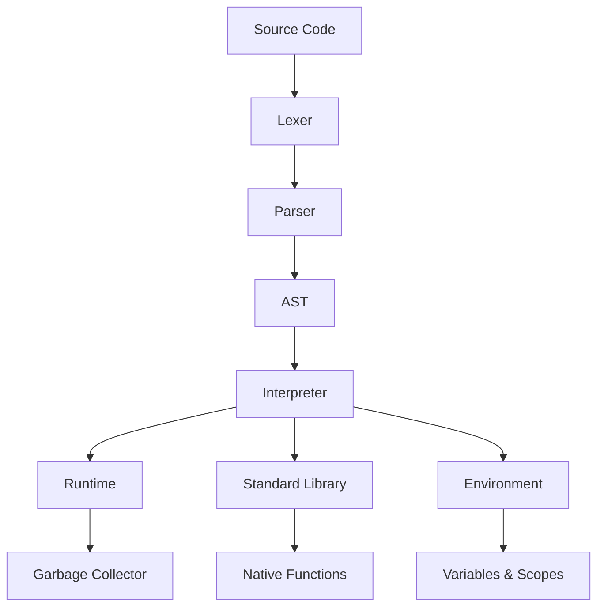

# ObSL Architecture Overview

This document describes the internal architecture of the Obliberry Scripting Language.

## High-Level Components



## Lexer

**Location**: `include/Lexer.h`, `src/Lexer/Lexer.cpp`

The lexer converts source code into tokens. It handles:
- Keywords (`fn`, `var`, `if`, `while`, etc.)
- Operators (`+`, `-`, `*`, `/`, `==`, `!=`, etc.)
- Literals (numbers, strings)
- Identifiers (variable/function names)
- Punctuation (`(`, `)`, `{`, `}`, etc.)

### Token Structure

```cpp
struct Token {
    TokenType type;      // enum class
    std::string_view lexeme; // original text
    uint16_t line;       // source line
    uint16_t column;     // source column
    uint32_t start_pos;  // start position in source
    uint32_t end_pos;    // end position in source
};
```

## Parser

**Location**: `include/Parser.h`, `src/Parser/Parser.cpp`, `src/Parser/ast.h`

The parser converts tokens into an Abstract Syntax Tree (AST). It implements a recursive descent parser with operator precedence.

### AST Nodes

The AST is composed of statements and expressions:

**Statements**:
- `ExpressionStmt` - expression statement
- `PrintStmt`, `PrintlnStmt` - print statements
- `VarStmt` - variable declaration
- `BlockStmt` - code block
- `IfStmt` - conditional
- `WhileStmt`, `ForStmt`, `ForeachStmt` - loops
- `FunctionStmt` - function definition
- `ReturnStmt`, `BreakStmt` - control flow
- `StructStmt` - struct definition
- `UsingStmt` - module import
- `TryCatchStmt` - exception handling

**Expressions**:
- `LiteralExpr` - literal values
- `VariableExpr` - variable reference
- `BinaryExpr`, `UnaryExpr` - arithmetic/logic
- `CallExpr` - function call
- `GetExpr`, `SetExpr` - object field access
- `IndexExpr`, `IndexAssignmentExpr` - array indexing
- `LogicalExpr` - logical operators
- `TypeCheckExpr` - `is` operator
- `GroupingExpr` - parentheses grouping
- `AssignmentExpr` - assignment
- `UpdateExpr` - increment/decrement

## Interpreter

**Location**: `include/Interpreter.h`, `src/Interpreter/Interpreter.cpp`, `src/Interpreter/Environment.cpp`

The interpreter executes the AST using a visitor pattern.

Key features:

### Environments

- **Global Environment**: Root scope for all scripts
- **Lexical Scoping**: Nested environments for blocks and functions
- **Closures**: Functions capture their enclosing environment
- **Thread Safety**: Uses `shared_mutex` for concurrent access

### Value Representation

```cpp
using Value = std::variant<
    std::monostate,    // null
    bool,             // boolean
    double,           // number
    std::string,      // string
    ObSLCallable*,    // function
    ObSLArray*,       // array
    ObSLObject*       // object/struct
>;
```

### Native Function Binding

ObSL supports binding C++ functions to the scripting environment:

```cpp
interpreter.define_native("sqrt", [](double x) -> double {
    return std::sqrt(x);
});
```

The `Natives.h` header provides traits and helpers for automatic type conversion and validation.

## Garbage Collection

**Location**: `src/GarbageCollector.h`, `src/GarbageCollector.cpp`

ObSL uses a mark-and-sweep garbage collector:

- **Cyclic Reference Handling**: Objects are tracked through linked list; unreachable cycles are collected
- **Root Tracking**: Marks global variables, stack frames, and native roots
- **Threshold-Based Collection**: Collection triggers when object count exceeds `allocated_objs * 2`

## Standard Library

**Location**: `include/StdLib.h`, `src/StdLib/StdLib.cpp`, `src/StdLib/StdModules.h`

The standard library provides built-in functionality organized into modules:

- **Conversion**: `to_string`, `to_fixed`, `to_num`
- **Math**: `sqrt`, `pow`, `abs`, `min`, `max`, `floor`, `ceil`, `round`, `random`, `clamp`
- **Trigonometry/Helpers**: `sin`, `cos`, `tan`, `atan2`, `rad`, `deg`, `pi`, `lerp`, `map_value`
- **Strings**: `len`, `to_upper`, `to_lower`, `trim`, `contains`, `starts_with`, `substring`, `replace`
- **Regex**: `regex_match`, `regex_search`, `regex_replace`, `regex_find_all`
- **System**: `file_exists`, `read_file`, `write_file`, `get_file_ext`, `read`, `readln`, `clock`, `sleep_thread`, `get_env`, `exit`
- **Reflection**: `type_of`, `get_arity`, `has_field`, `get_fields`

## Entry Point

**Location**: `include/ScriptEntry.h`, `src/ScriptEntry.cpp`

`ScriptEntry` is the entry point used by the `obsl_runtime` CLI (see `ObSLCoreMain.cpp`). It owns a single `Interpreter` instance directly and drives it through file execution, a REPL, or `--lint` mode:

```cpp
ObSL::ScriptEntry entry;
entry.exec(argc, argv);
```

This is a separate, single-threaded path from the `ScriptRuntime`/`ScriptWorker` pool described below   `ScriptEntry` does not go through `ScriptRuntime`. It's the entry point for running scripts standalone from the command line; `ScriptRuntime` is for embedding ObSL in a multi-threaded host application, such as the Obliberry Game Engine.

## Runtime & Workers

**Location**: `include/ScriptRuntime.h`, `src/ScriptRuntime.cpp`, `include/ScriptWorker.h`, `src/ScriptWorker.cpp`

ObSL supports multi-threaded execution:

- **ScriptRuntime**: Manages a pool of script workers
- **ScriptWorker**: Isolated interpreter instance with its own environment
- **Thread Safety**: Each worker has independent state

## Module System

**Location**: `src/Parser/Parser.cpp` (using statement)

Modules are imported using the `using` statement:

```obsl
using "path/to/module.obsl";
```

Module features:
- **Caching**: Modules are loaded once and cached
- **Isolation**: Each module gets its own environment
- **Re-export**: Module variables are available in the importing scope

## Error Handling

ObSL provides structured error handling:

- **RuntimeError**: Exception with token location
- **Try/Catch**: Script-level exception handling
- **Assertions**: `assert(condition, message)`
- **Throw**: `throw("message")`

## Build System

**Location**: `CMakeLists.txt`

The project uses CMake with:
- C++20 standard
- Static library (`libobsl.a`)
- Runtime executable (`obsl_runtime`)   built by default, disable with `-DOBSL_BUILD_RUNTIME=OFF` to produce only `libobsl.a` for embedding
- Dependency management (nlohmann/json)

## Thread Safety Design

- **Interpreter Mutex**: Protects interpreter state during execution
- **Environment Locks**: `shared_mutex` for concurrent reads/writes
- **Worker Isolation**: Each worker has independent interpreter and environment

## Notes

- **String Views**: Lexeme strings use `std::string_view` to avoid allocations during tokenization
- **Include Style**: All project headers are included with angle brackets (e.g. `#include <Interpreter.h>`, `#include <Parser/ast.h>`), reflecting that headers live in CMake include directories rather than being included relative to the source file
