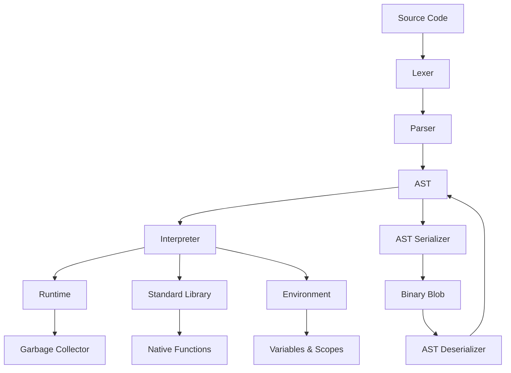

# ObSL Architecture Overview

This document describes the internal architecture of the Obliberry Scripting Language.

## High-Level Components



## Lexer

**Location**: `include/ObSL/Lexer.h`, `src/Lexer/Lexer.cpp`

The lexer converts source code into tokens. It handles:

- Keywords (`fn`, `var`, `if`, `while`, etc.)
- Operators (`+`, `-`, `*`, `/`, `==`, `!=`, etc.)
- Literals (numbers, strings)
- Identifiers (variable/function names)
- Punctuation (`(`, `)`, `{`, `}`, etc.)

### Token Structure

```cpp
struct Token {
    TokenType type;           // enum class
    std::string_view lexeme;  // original text 
    uint16_t line;            // source line
    uint16_t column;          // source column
    uint32_t start_pos;       // start position in source
    uint32_t end_pos;         // end position in source
};
```

## Parser

**Location**: `include/ObSL/Parser.h`, `src/Parser/Parser.cpp`, `include/ObSL/Parser/ast.h`

The parser converts tokens into an Abstract Syntax Tree (AST). It implements a recursive descent parser with operator
precedence.

### AST Nodes

The AST is composed of statements and expressions:

**Statements**:

- `ExpressionStmt` - expression statement
- `PrintStmt`, `PrintlnStmt` - print statements
- `VarStmt` - variable declaration
- `BlockStmt` - code block
- `IfStmt` - conditional
- `SwitchStmt` - switch statement
- `WhileStmt`, `ForeachStmt` - loops (`for` loops are desugared into a `WhileStmt` wrapping a `BlockStmt` at parse time; there is no `ForStmt` node)
- `FunctionStmt` - function definition
- `ReturnStmt`, `BreakStmt` - control flow
- `StructStmt` - struct definition
- `UsingStmt` - module import
- `TryCatchStmt` - exception handling

**Expressions**:

- `LiteralExpr` - literal values
- `ArrayExpr` - array literal
- `VariableExpr` - variable reference
- `BinaryExpr`, `UnaryExpr` - arithmetic/logic
- `CallExpr` - function call
- `GetExpr`, `SetExpr` - object field access
- `IndexExpr`, `IndexAssignmentExpr` - array indexing
- `LogicalExpr` - logical operators
- `TypeCheckExpr` - `is` operator
- `GroupingExpr` - parentheses grouping
- `AssignmentExpr` - assignment
- `UpdateExpr` - increment/decrement

## AST Serialization

**Location**: `include/ObSL/ASTSerializer.h`, `src/ASTSerializer.cpp`, `include/ObSL/ASTDeserializer.h`, `src/ASTDeserializer.cpp`

The AST can be serialized to a compact binary format and deserialized back. This enables pre-parsing scripts during a "
build" step (e.g. into `.obpak` archives) and executing them later without re-parsing the source code.

### SerializedModule

The top-level container for a deserialized AST:

```cpp
struct SerializedModule {
    std::vector<std::string> string_pool;
    std::vector<std::unique_ptr<Stmt> > statements;
};
```

### Binary Format

The serialized binary layout consists of three sections:

1. **String Table** — A deduplicated pool of all string literals, identifiers, and lexemes used in the AST. Each string
   is stored as `[length: uint32_t][chars...]`.
2. **Statement Count** — The number of root-level statements (`uint32_t`).
3. **Node Payload** — The serialized AST nodes, written depth-first.

### ASTSerializer

Walks the AST depth-first and writes each node into a flat `std::vector<uint8_t>` buffer. Nodes are identified by a type
tag (`ExprType` / `StmtType`), followed by their fields in a fixed order. Null pointers (e.g. optional sub-expressions)
are encoded as `0xFF`.

Key methods:

- `serialize_expr(const Expr*)` — serializes an expression node
- `serialize_stmt(const Stmt*)` — serializes a statement node
- `finalize(root_ast)` — builds the string table, assembles the complete binary blob

Usage:

```cpp
ObSL::Lexer lexer(source_code);
auto tokens = lexer.tokenize();
ObSL::Parser parser(tokens);
auto ast = parser.parse();

ObSL::ASTSerializer serializer;
std::vector<uint8_t> binary_blob = serializer.finalize(ast);
```

### ASTDeserializer

Reconstructs the AST from a binary blob produced by `ASTSerializer`. The static `deserialize()` method is the main entry
point:

```cpp
auto module = ObSL::ASTDeserializer::deserialize(binary_blob);
// module.string_pool: the reconstructed string table
// module.statements:  the root-level statements, ready for the interpreter
```

`deserialize()` returns a `SerializedModule` (see above). It reconstructs the string table, then reads nodes sequentially from the payload section, rebuilding
`std::unique_ptr<Stmt>` and `std::unique_ptr<Expr>` trees that can be passed directly to the interpreter or runtime.

### Limitations

- Runtime pointer types (`ObSLCallable*`, `ObSLArray*`, `ObSLObject*`) cannot be persisted. They are serialized as
  `std::monostate` and reconstructed as `null`.
- The format is not self-describing — serializer and deserializer must be in sync regarding node layouts and type tags.
- Struct names are serialized as plain string-table indices (a `uint32_t`) rather than full tokens. There is no version
  tag in the blob, so precompiled ASTs produced by an older build are not guaranteed to deserialize correctly and should
  be regenerated.

## Interpreter

**Location**: `include/ObSL/Interpreter.h`, `src/Interpreter/Interpreter.cpp`, `src/Interpreter/Environment.cpp`

The interpreter executes the AST using a visitor pattern.

Key features:

### Environments

- **Global Environment**: Root scope for all scripts
- **Lexical Scoping**: Nested environments for blocks and functions
- **Closures**: Functions capture their enclosing environment
- **Environment Pooling**: `acquire_environment()` reuses a fixed pool of 16 pre-allocated environments to avoid repeated
  allocation for function calls. Entries are found by linear scan; if all 16 are in use, a plain `make_shared<Environment>`
  fallback is allocated. Each pooled entry uses a custom `shared_ptr` deleter that returns the environment to the pool
  when the last reference is dropped.
- **Reset & Reuse**: Pooled environments are reset via `Environment::reset(enclosing)`, which clears variables and
  re-parents the scope without deallocating.
- **Zero Copy Variable Lookup**: `Environment::get_ref()` returns a `const Value&` directly from the map, avoiding
  copies during variable access.
- **Thread Safety**: Hot path environment access (`set_current_environment`, `get_current_environment`, `interpret`,
  `execute_block`) is lock free. The `recursive_mutex` (`m_interpreter_mutex`) is only held during garbage collection (
  `mark_roots`), environment registration (`register_environment`), and interpreter destruction. For single-threaded
  workers, `register_environment_unsafe()` provides a lock-free variant.

### Value Representation

```cpp
using Value = std::variant<
    std::monostate,    // null
    bool,             // boolean
    double,           // number
    std::string,      // string
    ObSLCallable*,    // function
    ObSLArray*,       // array
    ObSLObject*       // object/struct
>;
```

### Native Function Binding

ObSL supports binding C++ functions to the scripting environment:

```cpp
interpreter.define_native("sqrt", [](double x) -> double {
    return std::sqrt(x);
});
```

The `Natives.h` header provides traits and helpers for automatic type conversion and validation.

## Garbage Collection

**Location**: `include/ObSL/GarbageCollector.h`, `src/GarbageCollector.cpp`

ObSL uses a mark-and-sweep garbage collector:

- **Cyclic Reference Handling**: Objects are tracked through linked list; unreachable cycles are collected
- **Root Tracking**: Marks global variables, stack frames, and native roots
- **Threshold-Based Collection**: Collection starts with a threshold of 1000 allocated objects; after each sweep the
  threshold is reset to `allocated_objs * 2` so it adapts to the live set.

## Standard Library

**Location**: `include/ObSL/StdLib.h`, `src/StdLib/StdLib.cpp`, `src/StdLib/StdModules.h`

The standard library provides built-in functionality organized into modules:

- **Conversion**: `to_string`, `to_fixed`, `to_num`
- **Math**: `sqrt`, `pow`, `abs`, `min`, `max`, `floor`, `ceil`, `round`, `random`, `clamp`
- **Trigonometry/Helpers**: `sin`, `cos`, `tan`, `atan2`, `rad`, `deg`, `pi`, `lerp`, `map_value`
- **Strings**: `len`, `to_upper`, `to_lower`, `trim`, `contains`, `starts_with`, `substring`, `replace`
- **Regex**: `regex_match`, `regex_search`, `regex_replace`, `regex_find_all`
- **System**: `file_exists`, `read_file`, `write_file`, `get_file_ext`, `read`, `readln`, `clock`, `sleep_thread`,
  `get_env`, `exit`
- **Reflection**: `type_of`, `get_arity`, `has_field`, `get_fields`

## Entry Point

**Location**: `include/ObSL/ScriptEntry.h`, `src/ScriptEntry.cpp`

`ScriptEntry` is the entry point used by the `obsl_runtime` CLI (see `ObSLCoreMain.cpp`). It owns a single `Interpreter`
instance directly and drives it through file execution, a REPL, or `--lint` mode:

```cpp
ObSL::ScriptEntry entry;
entry.exec(argc, argv);
```

This is a separate, single-threaded path from the `ScriptRuntime`/`ScriptWorker` pool described below   `ScriptEntry`
does not go through `ScriptRuntime`. It's the entry point for running scripts standalone from the command line;
`ScriptRuntime` is for embedding ObSL in a multi-threaded host application, such as the Obliberry Game Engine.

### REPL AST Retention

The REPL executes each line immediately, but every line's parsed AST must stay alive for the rest of the session: script
functions and structs store raw pointers to their `FunctionStmt`/`StructStmt` declaration (`ObSLFunction::declaration`,
`ObSLStruct::declaration`), and `Token::lexeme` is a `string_view` borrowed from the source buffer. `ScriptEntry` therefore
retains both the source text (`m_repl_sources`) and the parsed statement list (`m_repl_asts`) for the lifetime of the
session, and each new line is lexed from the retained copy of its own source so those views and pointers never dangle.

## Runtime & Workers

**Location**: `include/ObSL/ScriptRuntime.h`, `src/ScriptRuntime.cpp`, `include/ObSL/ScriptWorker.h`, `src/ScriptWorker.cpp`

ObSL supports multi-threaded execution:

- **ScriptRuntime**: Manages a pool of script workers
- **ScriptWorker**: Isolated interpreter instance with its own environment
- **Thread Safety**: Each worker has independent state
- **Borrowed AST**: `ScriptWorker::execute()` takes the AST by const reference and does not own it. The statement tree
  must outlive the call and remain alive for the lifetime of the interpreter (e.g. an embedded runtime typically holds
  the parsed AST for the whole session).

## Module System

**Location**: `include/ObSL/Interpreter.h`, `src/Interpreter/Interpreter.cpp`, `include/ObSL/ModulePath.h`

Modules are imported using the `using` statement:

```obsl
using "path/to/module.obsl";
```

### Path Resolution

Module paths are **resolved relative to the script root** , a configurable base directory that defaults to the current
working directory. Paths are canonicalized (normalized) before use, so `"../dir/./module.obsl"` becomes a clean,
predictable key for caching and error reporting.

### Module Loader

Instead of reading files directly, the interpreter delegates module resolution to a **`ModuleLoader`** callback:

```cpp
struct ModuleResult {
    enum class Kind { Source, PrecompiledAst } kind;
    std::string source;
    SerializedModule ast_module;
};

using ModuleLoader = std::function<
    std::optional<ModuleResult>(const std::string &canonical_path)
>;
```

The loader can return either:

- **`Source`**: Plain source code, which will be lexed and parsed as normal.
- **`PrecompiledAst`**: A pre-built `SerializedModule` (see [AST Serialization](#ast-serialization)), loaded directly
  without re-parsing. This is useful for shipping pre-compiled scripts or loading from `.obpak` archives.

The default loader simply reads from the filesystem and returns `Source`, but host applications embedding ObSL can
override it via `interpreter.set_module_loader(...)` to load modules from virtual filesystems, archives, or network
sources.

### Circular Import Detection

If a module attempts to `using` itself (directly or transitively), the interpreter detects the cycle and throws a
`RuntimeError` message, preventing infinite recursion or deadlock.

### Deadlock Prevention

The module mutex is released during module execution. This allows recursive `using` calls.

### Lifecycle

- **Caching**: Modules are loaded once and cached by their canonical path. Subsequent `using` calls return the same
  module object.
- **Isolation**: Each module gets its own environment, preventing accidental cross-module pollution.
- **Re-export**: Module variables are copied into an `ObSLObject` that is bound in the importing scope.
- **Failed Load Cleanup**: If module execution throws, the partially-constructed module entry is removed from the cache,
  so a retry can attempt loading again.

## Error Handling

ObSL provides structured error handling:

- **RuntimeError**: Exception with token location
- **Try/Catch**: Script-level exception handling
- **Assertions**: `assert(condition, message)`
- **Throw**: `throw("message")`

## Build System

**Location**: `CMakeLists.txt`

The project uses CMake with:

- C++20 standard
- Static library (`libobsl.a`)
- Runtime executable (`obsl_runtime`)   built by default, disable with `-DOBSL_BUILD_RUNTIME=OFF` to produce only
  `libobsl.a` for embedding
- Dependency management (nlohmann/json)

## Thread Safety Design

- **Interpreter Mutex** (`m_interpreter_mutex`): `recursive_mutex` held only during GC root marking, environment
  registration, and interpreter destruction. The hot execution path is lock-free.
- **Modules Mutex** (`m_modules_mutex`): `shared_mutex` protecting the module cache during concurrent module imports.
- **Worker Isolation**: Each `ScriptWorker` has its own `Interpreter` instance with independent environments. Workers
  use `register_environment_unsafe()` (lock free) since they are the sole owner of their interpreter.
- **Environment Pool**: `acquire_environment()` returns a `shared_ptr<Environment>` with a custom deleter. The pool is
  only accessed from the owning thread; the custom deleter checks an atomic `m_PoolAlive` flag to safely return entries
  even during interpreter teardown.

## Notes

- **Include Style**: All project headers are included with angle brackets under the `ObSL/` prefix
  (e.g. `#include <ObSL/Interpreter.h>`, `#include <ObSL/Parser/ast.h>`), reflecting that headers live in CMake include
  directories rather than being included relative to the source file
- **Owned AST Names**: Identifier/name fields in the AST are `std::string`s, so nodes are safe to move or retain
  independently of the original source buffer. Only `Token` fields (e.g. literals, call/`bracket` punctuation) still hold
  `string_view` lexemes that borrow from the source.
